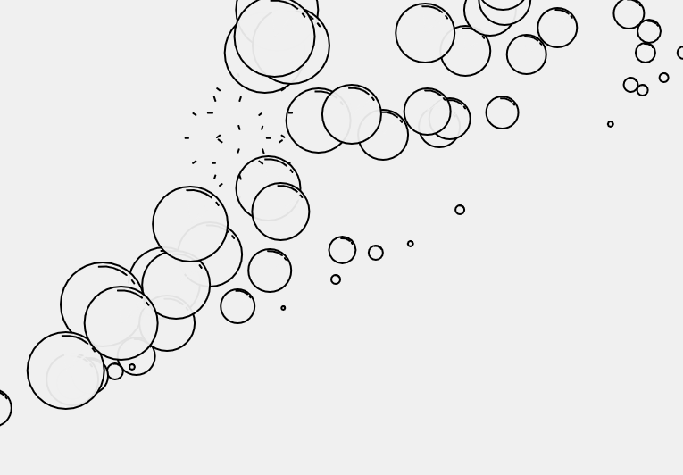

---

Tried to recreate natural looking/feeling bubbles...

<a href="https://souruly.github.io/P5-Playground/Bubbles/" target="_blank">Link to Sim</a>

I don't know, these bubbles just make me feel good. Relaxed..

---
I imagine someone to be blowing these bubbles from the bottom left of the screen. I tried to add some sort of rightward push,  gravity, buoyancy(?) and other forces to these bubbles so that they would float around in a realistic sense. **Clicking** on the bubbles also makes them **pop**. 

