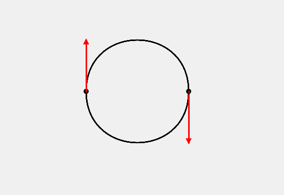
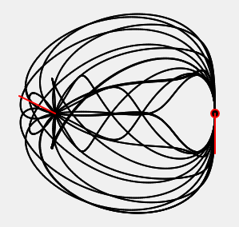

---

Simple Sim to show how **Cubic Hermite Polynomial Interpolation** works.

<a href="https://souruly.github.io/P5-Playground/Cubic_Hermite/" target="_blank">Link to Interactive Sketch</a>

I had this particular topic for my Computer Graphics course. So, to better understand how this interpolation method works, I made this sketch.

The polynomial is built in such a way that it satisfies the given two points as well as the first derivative at those points...

---

To make it more artsy, I made the tangent to the curve at the first point to rotate. That's why we see such intricate design in the above picture. (Not included in the sketch)

