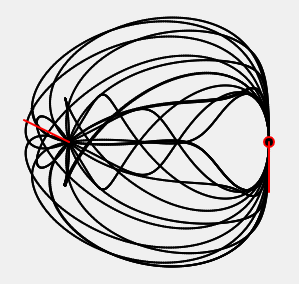

---
Simple Sim to show how **Cubic Hermite Polynomial Interpolation** works. For Computer Graphics Course...

<a href="https://souruly.github.io/P5-Playground/Cubic_Hermite/" target="_blank">Link to Interactive Sketch</a>

