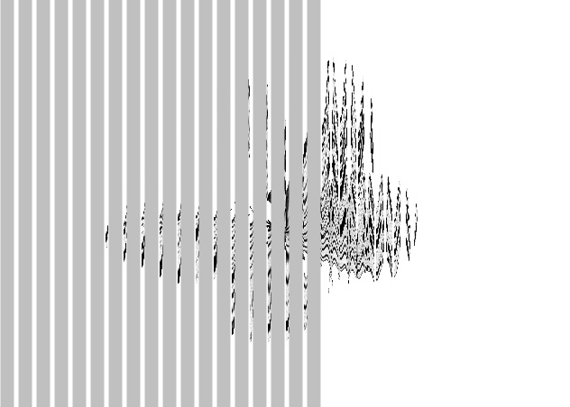
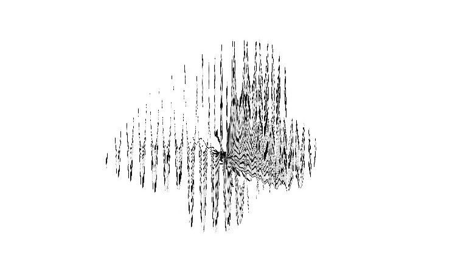
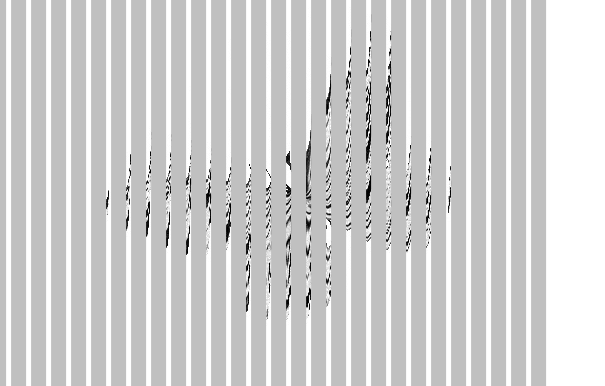

---

Saw a <a href="https://youtu.be/UW5bcsax78I" target="_blank">cool video</a> on Youtube, wanted to recreate that effect in Code.

First I wrote a (Python) code to take any GIF and get its frames.

Frames are then processed by another Python code to make the Fuzzy background image.

P5 JS moving black rectangles are laid on top to make the animation.

<a href="https://github.com/Souruly?tab=repositories" target="_blank">Link to Github Repo</a>

<a href="https://souruly.github.io/P5-Playground/Scanimation/" target="_blank">Link to the Interactive Animation</a>

---

Now, to how this works...

There's just s static image as the background. This image as I said earlier, is generated from an animated gif using a python code.

This image looks the way it looks because it has all the frames of the animation embedded in it. (Ofc, lossy embedding.) This type of embedding has to take into account the number of frames of animation, the size of the strips that are going to be overlayed and the distance between adjacent stripes.

When the stripes are moved laterally over this static image, some parts are shown through the gaps and some are blocked by the stripes. Depending on what is visible to the user, as the stripes move along, the user gets to see the animation.

Now it's really hard to see this in an image like above, but please try it yourself.