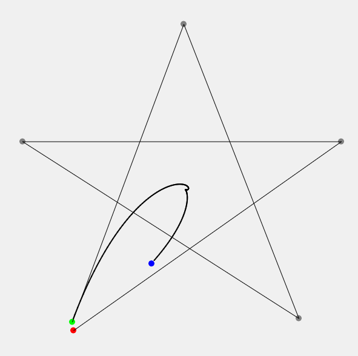

---

Simple Sim to show how **Generalized Bezier Curves** works.

<a href="https://souruly.github.io/P5-Playground/Generalized_Bezier/" target="_blank">Link to Interactive Sketch</a>

I had this particular topic for my Computer Graphics course. So, to better understand how this interpolation method works, I made this sketch.

The [Berstein Polynomial](https://en.wikipedia.org/wiki/Bernstein_polynomial) and a given set of (n+1) control points together form the [Bezier Curve(https://en.wikipedia.org/wiki/B%C3%A9zier_curve)]. It is built using the Binomial Expansion of (t + (1-t))^n, which is used as recursive linear interpolation between different levels of control point sets.

---

