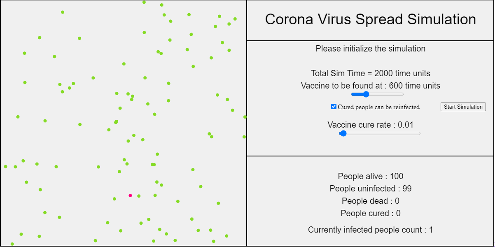
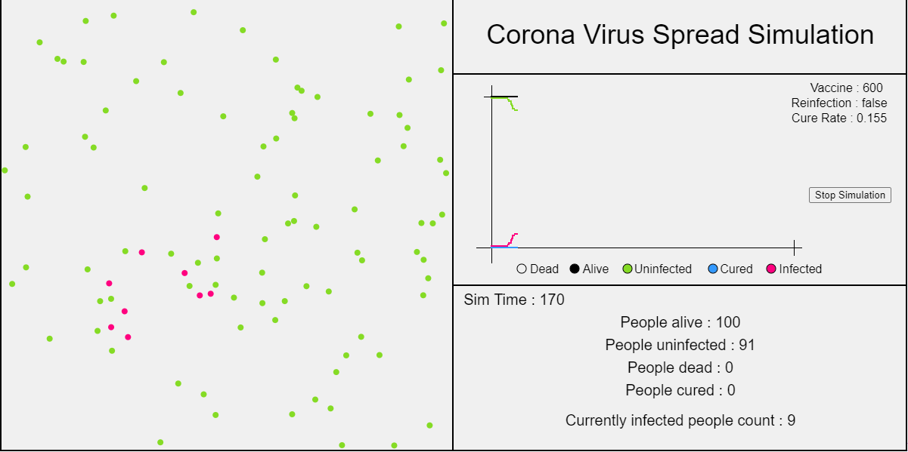
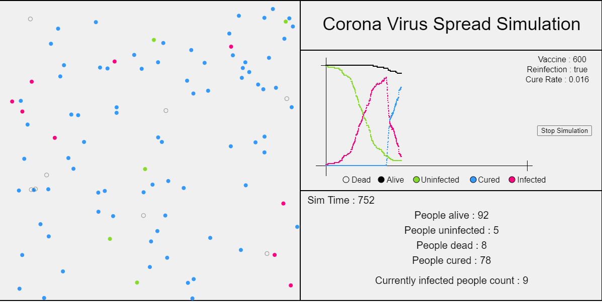

---

Inspired by <a href="https://youtu.be/gxAaO2rsdIs" target="_blank">this</a> beautiful video by <a href="https://www.youtube.com/channel/UCYO_jab_esuFRV4b17AJtAw" target="_blank">3Blue1Brown</a>, I tried making a simulation of the spread of Covid-19.

<a href="https://souruly.github.io/P5-Playground/Corona_Spread_Simulation/index.html" target="_blank">Link to Sim</a>

Please open this link in a new tab and read along.

Each circle represents a person moving randomly through space, and each collision counts as a contact. As people come into contact with each other, the disease spreads through the population.

Now as you can see, some people are getting infected(red) while most are still safe(green).

We assume that the vaccine is going to be invented at some point of time. After which, people start getting vaccinated(circles randomly turn blue).

Once all paramenters are set, we start the simulation and take a look how the virus spreads, how many people get vaccinated(blue), how many people would never even come in contact with the virus(still green) and how many people would unfortunately die(hollow circle).
