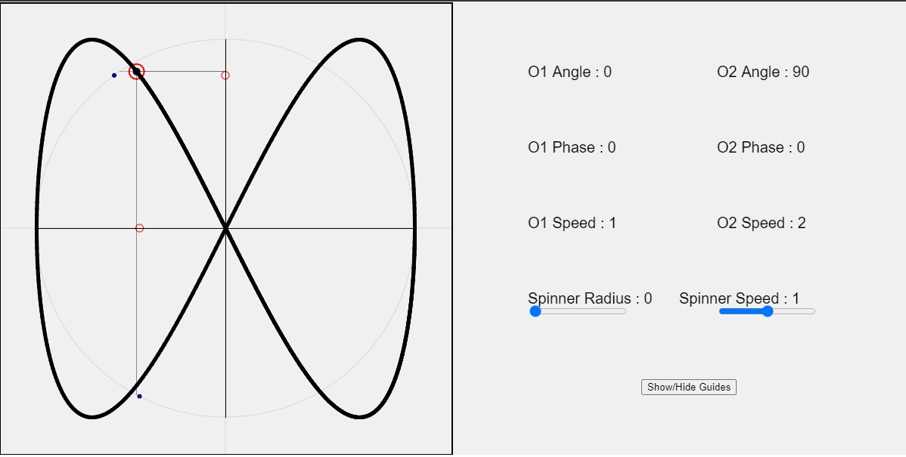
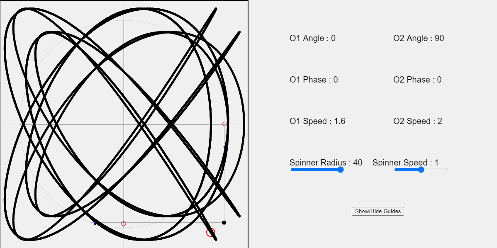

---
Trying to visualize how two oscillators and a spinner working in tandem would result in a compound function of sorts...

<a href="https://souruly.github.io/P5-Playground/Tandem_Oscillators/index.html" target="_blank">Link to Interactive Sketch</a>

Please open the link and then read along.

One oscillator moves vertically, and other oscillator moves horizontally.(These are the default setting in the sketch. The angles can be changed. Please do!!)

The X- coordinate of the horizontal oscillator and the Y-coordinate of the vertical oscilltor gives the position of the point. (Let's call this point P1)

Initially the sketch was just going to be that much. But then I thought of adding one more level of complexity to the equation. So there's also a spinner 
with center at P1 and given size and speed. The final point drawn on screen(in thick black lines) is the end point of this spinner.

PS : If you let this run for a while, you'd see that the drawing returns to it's start point. This depends on what initial parameters you choose. The simplest parameters where the values have a small LCM would converge faster, in one-two loops. Please play around with the sliders to have more complex drawings...

Now ^this isn't even the most crazy you can get, I kept almost all the parametes as they were initialized. The only thing I changed was O1 speed, from 1 to 1.6. This, coupled with O2 speed of 2, forms makes a design with about 5-6 loops. There's a lot more room for complexity.