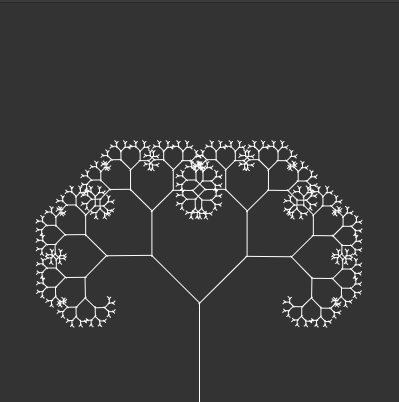
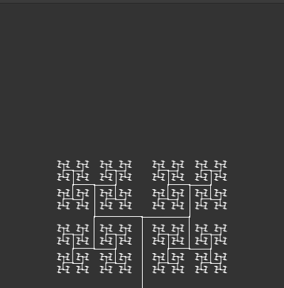

---

A simple tree sketch where each branch splits into two at a particular angle.

<a href="https://souruly.github.io/P5-Playground/Binary_Tree/index.html" target="_blank">Link to Interactive Sketch</a>

Play with the slider to change the angle of branching.

<u>PS(6th March 2021)</u> :  
I used this same binary tree in my Biology inspired projects page. <a href="https://souruly.github.io/Bio" target="_blank">Link</a>

<u>Acknowledgements</u> :   
This is a really old sketch when I made when I was still learning how to code. I cannot express the amount influence Dan Schiffman and his Youtube channel <a href="https://www.youtube.com/user/shiffman" target="_blank">The Coding Train</a> has had on me during this period. I'm sincerely grateful for his education videos.

