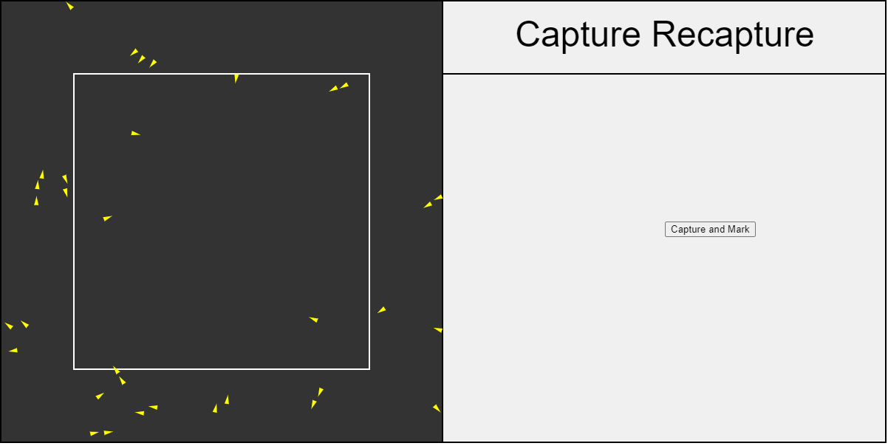
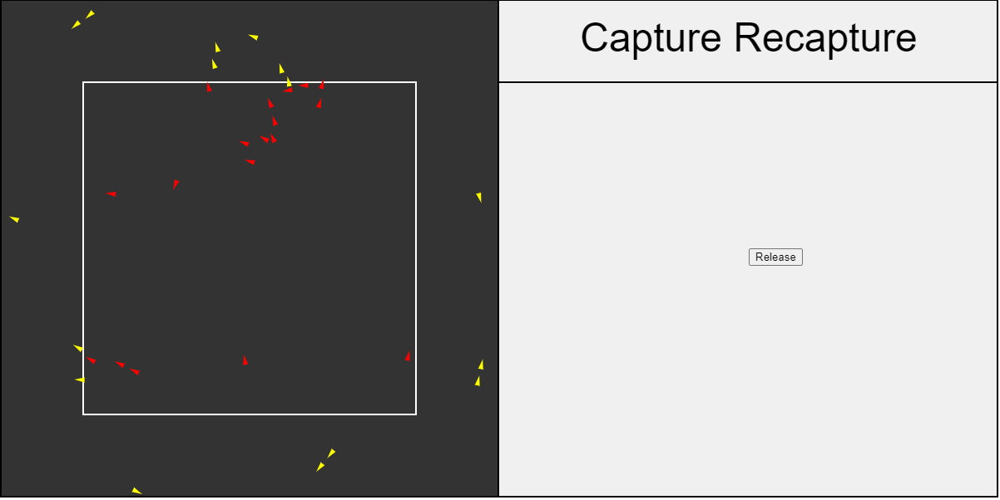
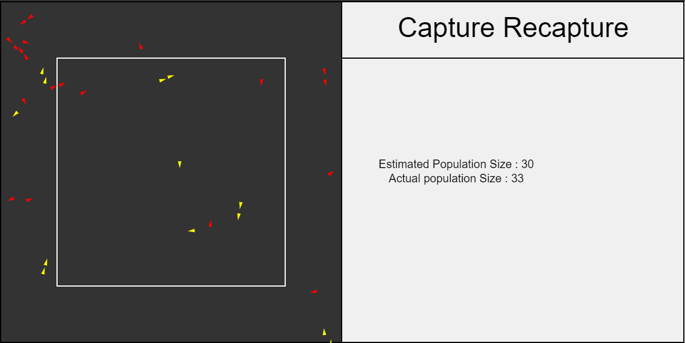

---

Inspired by <a href="https://www.youtube.com/watch?v=MTmnVBJ9gCI" target="_blank">this</a> video by <a href="https://www.youtube.com/channel/UCSju5G2aFaWMqn-_0YBtq5A" target="_blank">Matt Parker</a>, I tried making a simple sketch to check illustrate the capture- recapture method. (<a href="https://en.wikipedia.org/wiki/Mark_and_recapture" target="_blank">Wikipedia Article</a>). 

<a href="https://souruly.github.io/P5-Playground/Capture_Recapture/index.html" target="_blank">Link to Interactive Sketch</a>

Please open the sketch in another tab and read along.

The Capture-Recapture method is used for estimating things like the population size when actual counting of each individual is impractical. Now in the sketch, we have some birds(yellow triangle) flying around (with flocking behaviour!!). The white square represents the ecologists's net. Each time you press the button, the birds inside the net are "captured and marked" (they turn into red triangles).

The captured birds are then released and captured again n-number of times. Depending on a formula that takes into account the number of already marked birds that are found in this instance of the "capture", we can estimate the population size.

YOu may think that these popoulation estimates are not that great. But in case of higher population sizes and more number of recaptures, the accuracy improves. However, that requires a different formula for calculation.

PS(6th March 2021) : 

I similar <a href="https://souruly.github.io/Bio/Flocking/index.html" target="_blank">Flocking Simulator</a> is available on the <a href="https://souruly.github.io/Bio" target="_blank">Biology Project Page</a>
