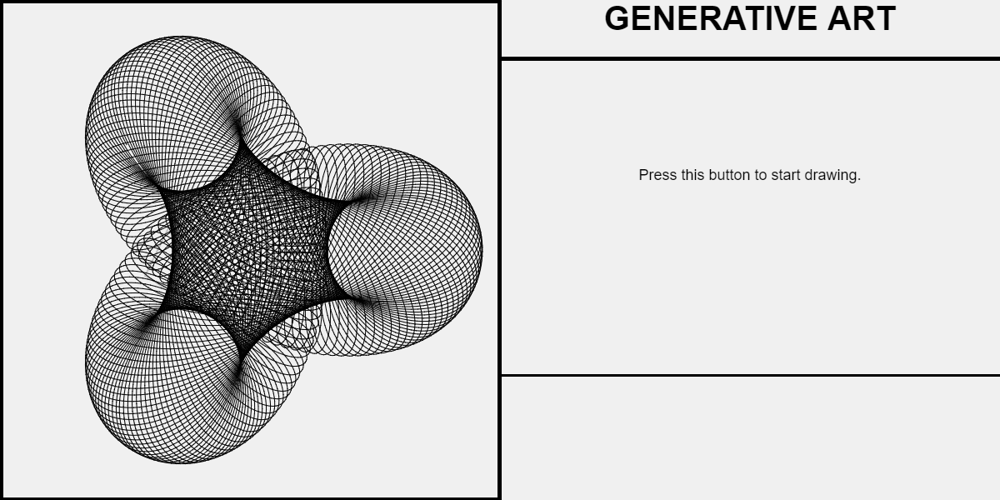
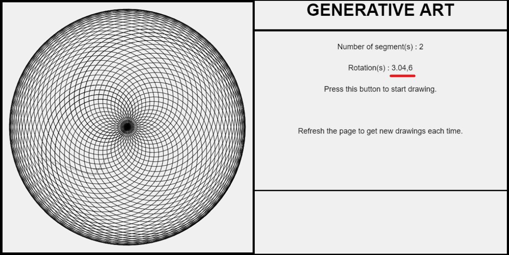
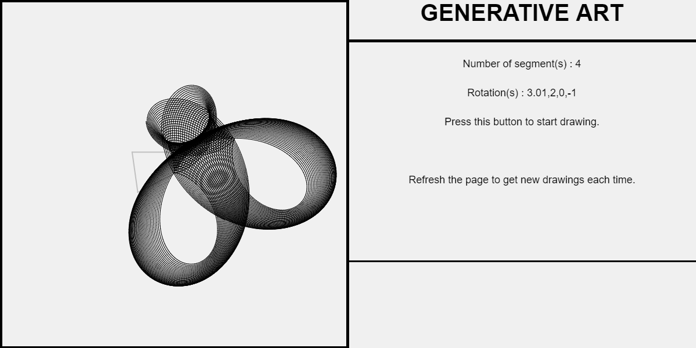
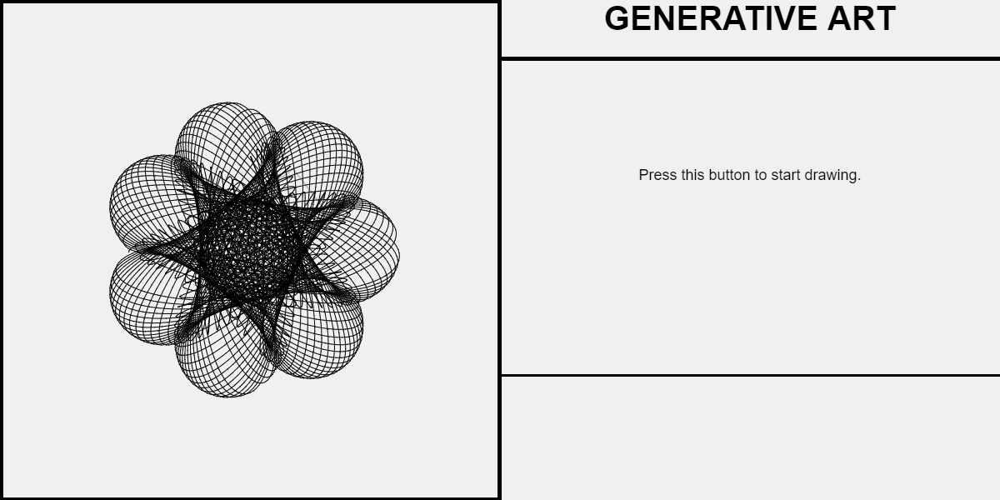

---

What would a compoud function of a bunch of rods attached end to end spinning independently would look like?

<a href="https://souruly.github.io/P5-Playground/Generative_Art/index.html" target="_blank">Link to Interactive Sketch</a>

If you look at the above image, we have two spinning rods with rotations 3.04 and 6 respectively. That small 0.04 is what makes this so interesting. The rods would come very close to a previously traced path but would just miss it. These small imperfections(?!) add up and and then the curve would perform completely differently over time. But eventually, when all parameters reach their LCM and are in phase, it would come back to the previous paths. 

Please keep it running for a while to see the complexity emerge...

Some Examples :

---

<u>**PS(6th March 2021)**</u> :  
I've always been intereted in these kinds of designs. I always loved the complexity of the Mandala, or the intricacies of finely sculpted walls of temples, 1000pc jigsaw puzzles, Escherian drawings and so on. I would've loved to draw a good Mandala art or some insanely detailed hyperrealistic sketches. But unfortunately (or fortunately) I have terrible drawing skills. Therefore, I have to depend on tools. When I found coding as one such tool I was elated!! This, back in 2017 was one of my first attempts at doing something like this. Procedurally generating art. How can something as simple as rotating sticks make something so beautiful!! I was instantly hooked. If you browse more of my projects, you will find similar themes..
After 4 years, as of now, I play around with shaders to make more such visualizations...

<u>Acknowledgements</u> :   
This is a really old sketch when I made when I was still learning how to code. I cannot express the amount influence Dan Schiffman and his Youtube channel <a href="https://www.youtube.com/user/shiffman" target="_blank">The Coding Train</a> has had on me during this period. I'm sincerely grateful for his education videos.
