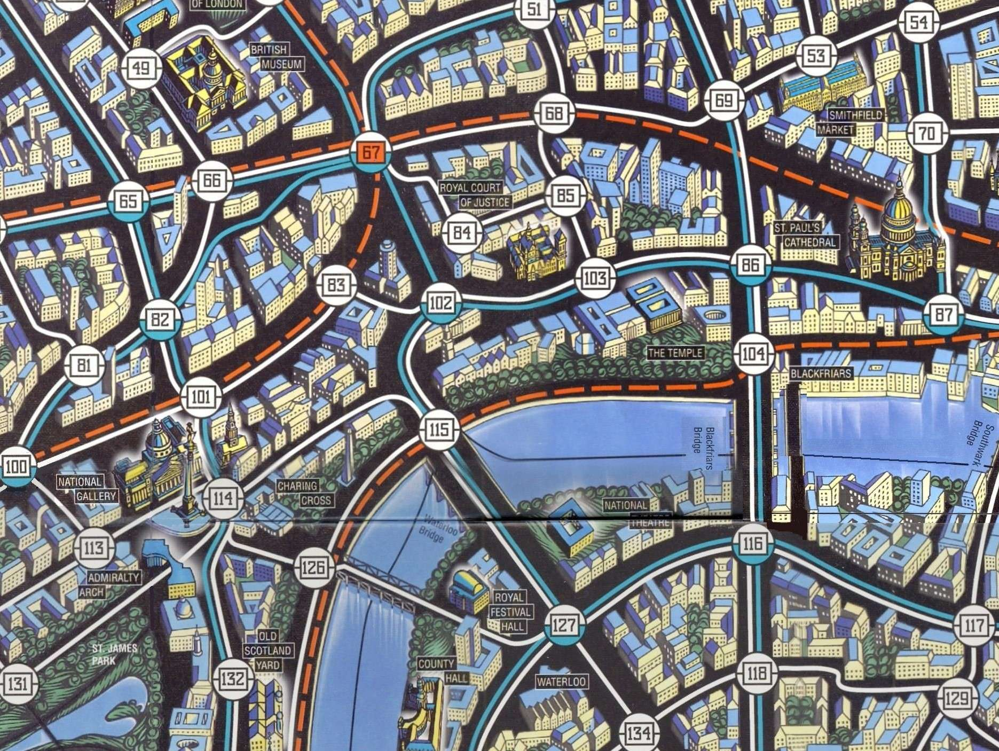
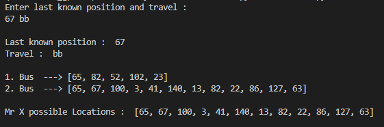
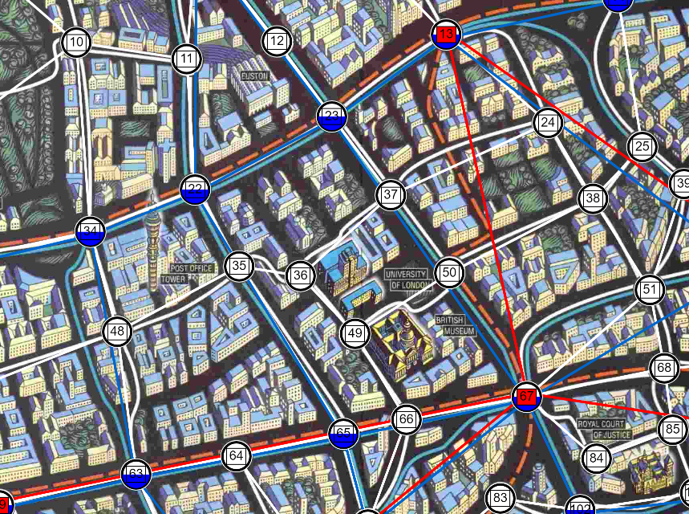

---

I was playing Scotland Yard with my friends. I may be very bad at doing the guesswork and taking in all the posibilities but I can very easily make a program that would do it for me.

<a href="https://github.com/Souruly/Scotland-Yard-Helper" target="_blank">Link to Github Repo</a>

The first thing I did was download the entire map, and then convert all the nodes and the connections into a JSON file. Then the map looked like <a href="https://souruly.github.io/Scotland-Yard-Helper/" target="_blank">this</a>.

The next step was making a simple python program that would build the graph using the JSON file and then traverse it in Breadth First format.

The program takes into input as the last known position of Mr. X and his travel history.

Based on this, we get all possible nodes where he could be.