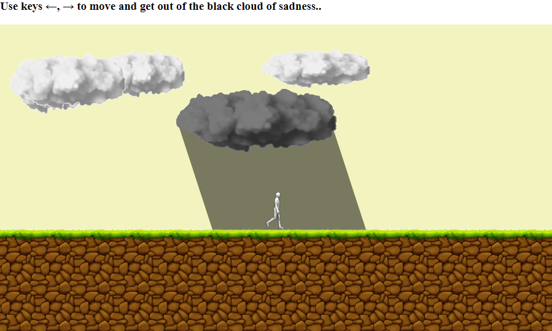

---

I have a friend who has/had depression. I made this sketch just to illustrate how it feels to be depressed...

<a href="https://souruly.github.io/P5-Playground/Depression/index.html" target="_blank">Link to Interactive Sketch</a>

Open the link in a new tab and read along.

You can use the arrow keys to move your character around and get out of "sadness" (= black cloud)

But the thing is, no matter how hard you try, you just stay where you are. And the cloud keeps following you too. There is no escape. Just eternal sadness. That's how it feels...

^How I interpret it...

---

This is the first time I used sprite sheet to make an animated character. I also used some external assets to make the clouds and the ground. I really had a lot of fun making the different sized clouds, overlapping them, then making the ground with green grass on top, adding controls to the character and so on!!

This looks waayy better than the usual geometrical shapes I use in my sketches. It works great and isn't that hard either!!

---

<u>**PS(11th March 2021)**</u> :  
I just wanted to add : I should've made the ground move according to character movements...

The code is available on Github if anyone wants to play around and make changes