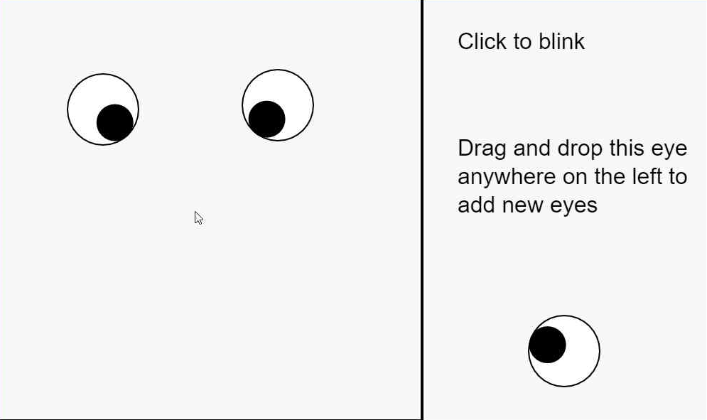

---

Back in my college days, I had a friend who had big eyes! I wanted to make something inspired from her... 

<a href="https://souruly.github.io/P5-Playground/Eyes/index.html" target="_blank">Link to Interactive Sketch</a>

The eyes always "look" at the position of the mouse. And blink when  clicked....

That's it. That's the entire project. And I absolutely love it!

---

<u>**PS(11th March 2021)**</u> :  
I remember, about a year later, in 2018, I had made a similar program in Java. I was a part of my college TEDx team and wanted to make an installation for putting up on the event day.

The idea was that we would have a large screen(like a tv) with a webcam(I had also thought of putting up a row of these setups along a long wall. But budget concerns...). It would only have two eyes on the screen which would "look" at whoever passed by...I had done this using (iirc) OpenCV Face Detection...

Ultimately, the idea was scrapped for some reasons...

I must have code lying around somewhere though..I'll check and put it up on Github if possible..