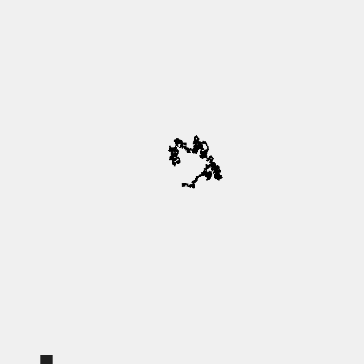
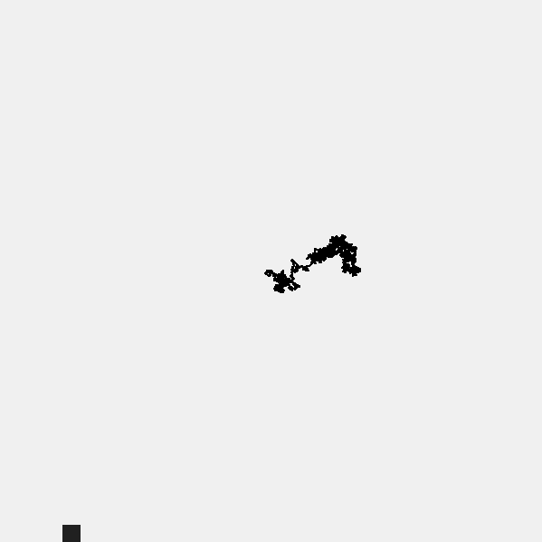

---

The path of life : 

<a href="https://souruly.github.io/P5-Playground/Life/index.html" target="_blank">Link to Interactive Sketch</a>

You can press the Right Arrow Key to go ahead in Life(slider moves right)...

I implemented a <a href="https://happycoding.io/examples/processing/animation/random-walker" target="_blank">Random Walker</a> as a way of describing how we take decisions in life which decides the path life takes...

There's also a posibility of going back in life, using the Left Arrow Key(slider moves left).. You can undo your mistakes, and relive the days of your youth. But once you go back, you can never reach that same path/position as before...

You are what you are right now as an end product of all your good and bad times...

---

I wanted to create this as a large installation in some gallery...

Some day...

---

<u>**PS(11th March 2021)**</u> :  
Now that I look back at this old sketch, There are some things that I would like to change : 

- The slider isn't that intuitive. Maybe adding a few markings would help.
