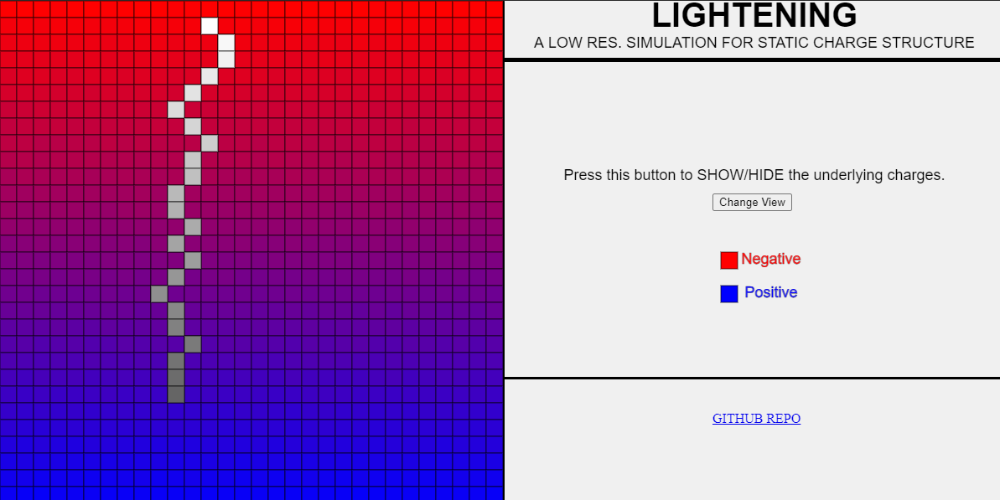

---

A simple sketch to explain how lightening bolts work.

<a href="https://souruly.github.io/P5-Playground/Lightening/index.html" target="_blank">Link to Sketch</a>

A ligtening bolt always traces the <a href="https://en.wikipedia.org/wiki/Principle_of_least_action" target="_blank">path of least resistance</a> from a point of high negative charge(clouds) to high positive charge(Earth's surface)(grounded).

In such a case, at every point in space, the bolt decides which way to go based on the neighboring points of space and the charges assosciated to it. Remember, it wants to end at the the point at the surface of the earth. But how would it know exactly where the earth is, with respect to its origin. Based on how far it can "look"( = sense the charge structure of surrounding space), iw would take the shortest path to the point of least charge. Then it would continue the same process till it dies down.

In case of this sketch, we have a 2D-world. This world already has some charge sructure assosciated to the space (similar to the real world). The lightening bolt starts at some random point in the upper part of the frame. At every point of its journey, until it dies out, it would check its neighboring 8 cells to find the lowest charge and move to that cell.

---

<u>**PS(11th March 2021)**</u> :  
This sketch also has a lightening sound. Back when I made this, 4 years ago, I think Chrome automatically gave permission for websites to play sound. But I checked it today and the sound is not working. If you want, you can enable the sound again by just giving the appropriate permissions. It would just add to the experience. But even if you don't you won't miss out on anything important...

<u>Acknowledgements</u> :   
This is a really old sketch when I made when I was still learning how to code. I cannot express the amount influence Dan Schiffman and his Youtube channel <a href="https://www.youtube.com/user/shiffman" target="_blank">The Coding Train</a> has had on me during this period. I'm sincerely grateful for his education videos.
