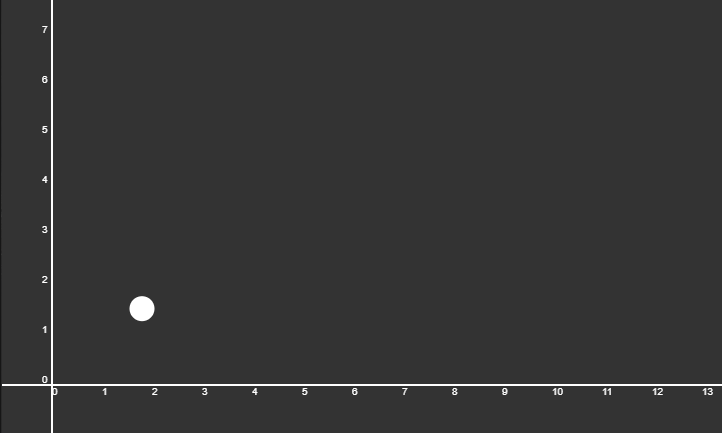

---

A simple projectile motion sketch as a part of a physics engine

<a href="https://souruly.github.io/P5-Playground/Simple_Projectile_Motion/index.html" target="_blank">Link to Sketch</a>

The ball does not move in a predetermined path. All it has is an initial velocity and an angle as the input. The 2D game world, has a sort of gravitational downward force acting on all abjects. These parameters together make the ball move the way it does.

---

<u>**PS(11th March 2021)**</u> :  
This is a fairly old sketch, and a very simple one indeed. But it does what it promised. I wanted to learn how to add forces, velocities and other such physical parameters to a game-world, and I learnt that from making small sketches like this. If you see some other sketches, you'll see that I use these concepts a lot...

There are some improvements that I could've done to this sketch to better illustrate the effect, but I didn't think of them 4 years ago and I won't make the changes now. But the code is available on Github if anyone wants to play around. Some changes would be : 
- Add a dashed line tracing the path of the projectile
- Make the sketch interactive by letting the user set the initial angle and velocity
- Add a "Reset Sketch Button"

<u>Acknowledgements</u> :   
This is a really old sketch when I made when I was still learning how to code. I cannot express the amount influence Dan Schiffman and his Youtube channel <a href="https://www.youtube.com/user/shiffman" target="_blank">The Coding Train</a> has had on me during this period. I'm sincerely grateful for his education videos.
