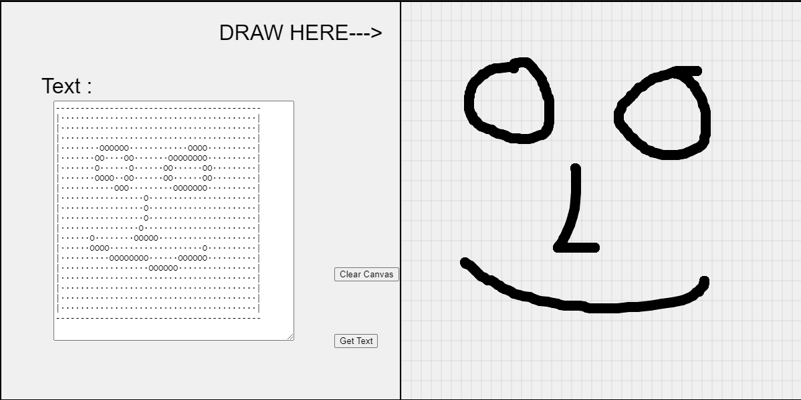

---

One day I wanted to send a text message to one of my friends. Not a normal message though. You know one of those messages you find on web forums and all that have this ASCII Art? Something like that. And I also wanted to send a custom message, not something I'd downloaded from the interned. So I made this...

<a href="https://souruly.github.io/P5-Playground/ASCII_Art/index.html" target="_blank">Link to Interactive Sketch</a>

At first I had put in the non-drawable part as a blank space. But Whatsapp seems to compress consecutive blank spaces, so the message didn't go as intended. Therefore, I resorted to using . and O.

However, there's one more problem with the program. It doesn't take into account screen sizes and therefore doesn't work as expected when messaging platforms manage overflow based on the available screen space.

If anybody wants to make any changes, the code is available on github.