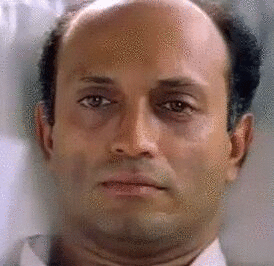
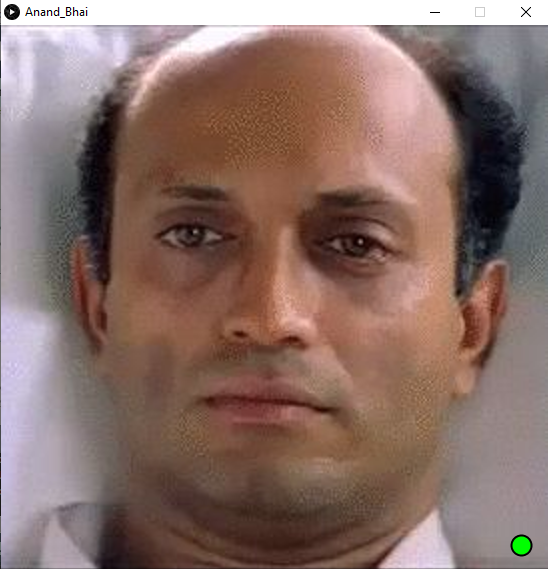
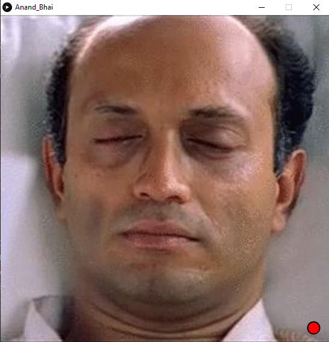

---

 

<a href="https://github.com/Souruly/Processing-Projects/tree/main/Anand%20Bhai/Anand_Bhai" target="_blank">Link to Project Repo</a>

I wanted to make a kind of installation that we can have in a corridor, inspired from Anand Bhai's character in <a href="https://www.imdb.com/title/tt0374887/" target="_blank">Link to Project Repo</a>

As some background, Anand Bhai is a patient(case study) in a medical college/hospital. He has been unresponsive for the last however many decades.

Now when the protagonist comes along, we notice that Anand Bhai only responds(blinks) to his presence, and that too only when nobody else is watching.

So in this project I used OpenCV Face Detection to detect whether a face is visible and only when no face is visible, initiate the blinking sequence.

The small green dot on the bottom right corner tells that a face is visible

The small dot is red, that means no face is visible. So Anand Bhai is free to blink and communicate.

---

<u>**PS(13th March 2021)**</u> :  
This project is about 3 years old now. I was just learning about reading files, images in Java, OpenCV, Face Detection and this tied everything together. Back in the college days when everything was about memes and joking around, I had a lot of fun making this and showing it to my friends.

It may have some problems, but the github link is available. You can download the code and make changes if you want.