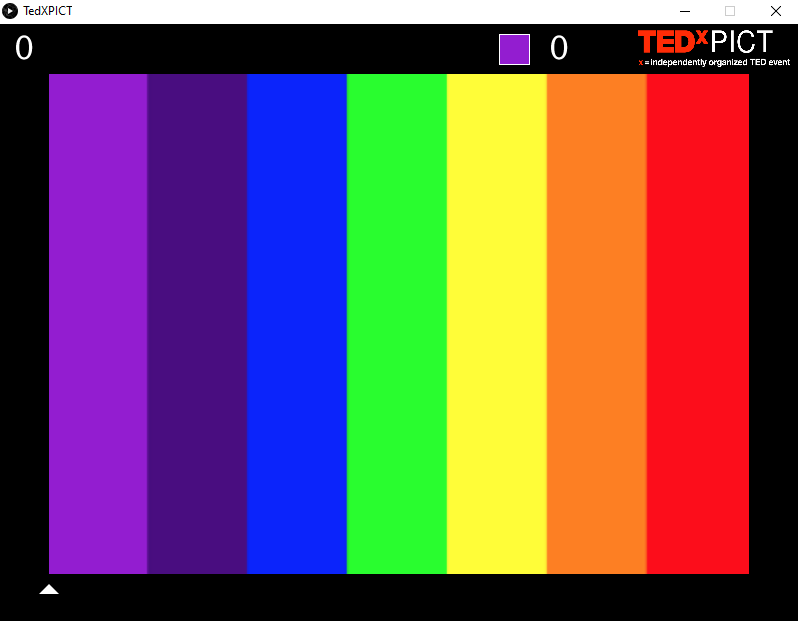
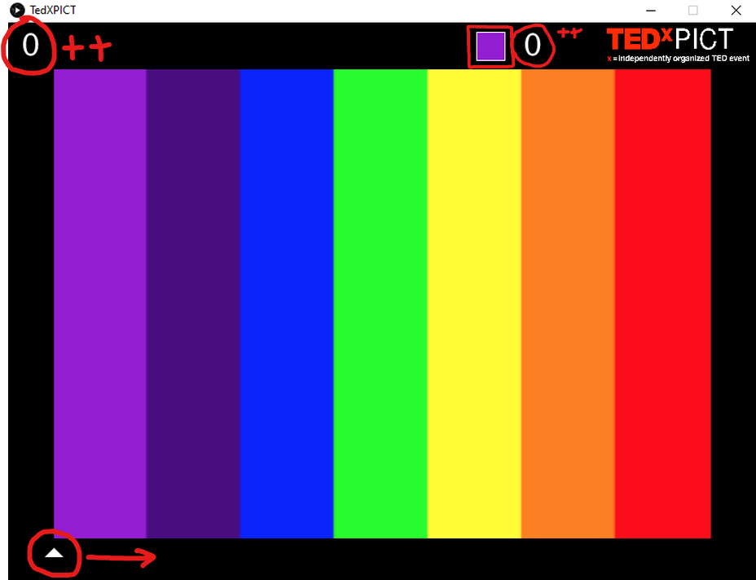

---

I was a part of the TEDxPICT Design Team. Our theme for the event was "Life in Technicolor". As a part of my duties, I had to make some posters, designs and so on. I came up with an idea to have an installation at the venue of the final event where people could interact with the theme. That's when I came up with this idea.

 

<a href="https://github.com/Souruly/Processing-Projects/tree/main/Arduino%20Exercise%20Bike%20Game/TEDxPICT%20Installation" target="_blank">Link to Project Repo</a>

The player gets 20 seconds. In this 20 seconds the goal is to get the arrow at the bottom left of the screen across the hotizontal spectrum to the bottom right. Depending on how far you can go, you get scored and you get the corresponding "technicolor" color value.(top-center right)

See it in action  : <a href="https://youtu.be/18pAVyCatd4" target="_blank">Youtube Link</a>.

<u>How it works</u>:

I built a small button-like apparatus that would get pressed every time the pedals completed one revolution. This passes on a signal to the arduino, which then communicates to the Processing Sketch via the computer serial port. Each such ping then modifies the counter, which keeps the score. As the score increases, we can see it change the value at the top left and the pointer at the bottom starts moving rightwards. Timer at the top center right counts from 0 to 20 and the next to it is a badhe which displays your current colour.

 

---

<u>**PS(14th March 2021)**</u> :  
This project is about 4 years old now. I had just started learning Arduino and <a href="https://processing.org/" target="_blank">Processing</a>. I thought this was a cool idea that would make random strangers exercise a bit and have fun too. But unfortunately it did not fulfil it's purpose of being turned into an installation due to some unforseen circumstances.

Also, I checked the code today, and it seems back then I couldn't figure out how to pass integer values over serial port. So what I did (ingenious, lol) is send strings of increasing sizes.(A,AA,AAA,AAAA...and so on) and then calculate the score based on the value of the string!

If anyone wants to play around with the code and make/suggest some changes, it is available on github.