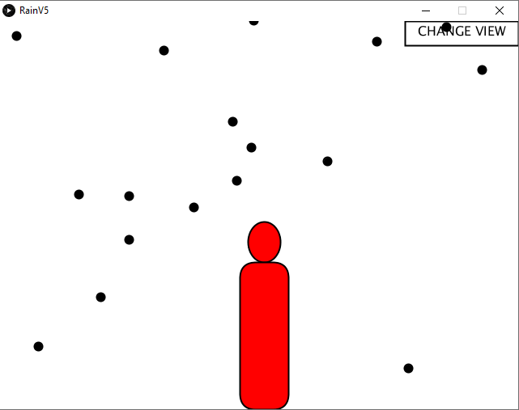
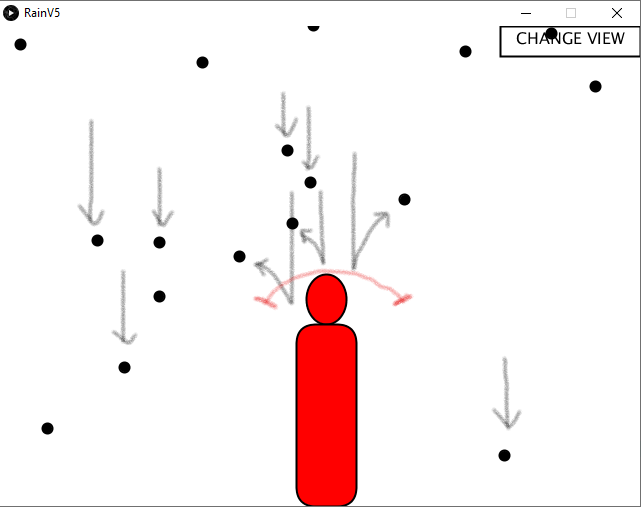

---

 

<a href="https://github.com/Souruly/Processing-Projects/tree/main/Rain/RainV5" target="_blank">Link to Project Repo</a>

Intended to be an art installation of some sort. Inspired from <a href="https://youtu.be/EkvazIZx-F0" target="_blank">this</a>.

I imagined this being projected onto a plain white wall. It would have a lot of raindrops(those black circles) falling down. There would also be a camera places somewhere near the projector. As soon as the camera detects the person walking in front of the projected frame, the raindrops would bounce off an imaginary shield covering the person.

 

If we click on the "Change View" button on the top-right corner, we would see the live camera view with OpenCV face detection

(The red image of the person is just symbolic and would not have been included if this was actually installed somewhere...I had just put it in while testing it on the class projector to see if it worked fine. It does.)

(One more thing, you might have to change the mapping from "0 to ScreenWidth" to "ScreenWidth to 0", or vice versa depending on your camera orientation)

---

<u>**PS(14th March 2021)**</u> :  
This project is about 4 years old now. I was just learning about OpenCV, Face Detection and <a href="https://processing.org/" target="_blank">Processing</a>. I didn't have a great laptop or that much experience either. If I had I would've made this look better. But I didn't back then. And I won't change anything now. It may have some problems, but the github link is available. You can download the code and make changes if you want.